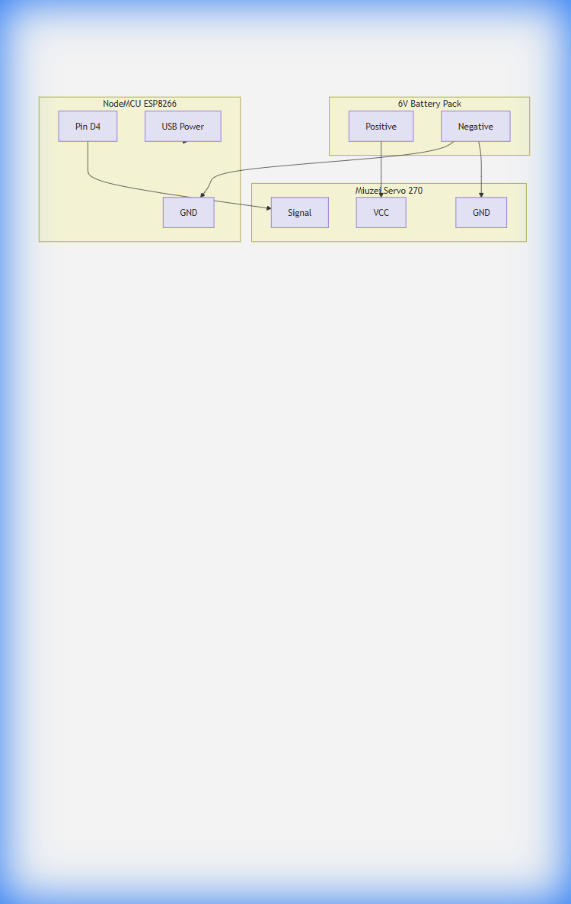

# Wiring Diagram

```mermaid
graph TD
    subgraph Power_Source [6V Battery Pack]
        Bat_Pos[Positive (+)]
        Bat_Neg[Negative (-)]
    end

    subgraph Controller [NodeMCU ESP8266]
        ESP_GND[GND]
        ESP_D4[Pin D4 (GPIO2)]
        ESP_USB[USB Power]
    end

    subgraph Actuator [Miuzei Servo 270°]
        Servo_VCC[VCC (Red)]
        Servo_GND[GND (Brown/Black)]
        Servo_Sig[Signal (Orange/White)]
    end

    %% Power Connections
    Bat_Pos -->|Power| Servo_VCC
    Bat_Neg -->|Common Ground| Servo_GND
    Bat_Neg -->|Common Ground| ESP_GND

    %% Signal Connection
    ESP_D4 -->|PWM Signal| Servo_Sig

    %% Controller Power
    ESP_USB -.->|5V| Controller
```



